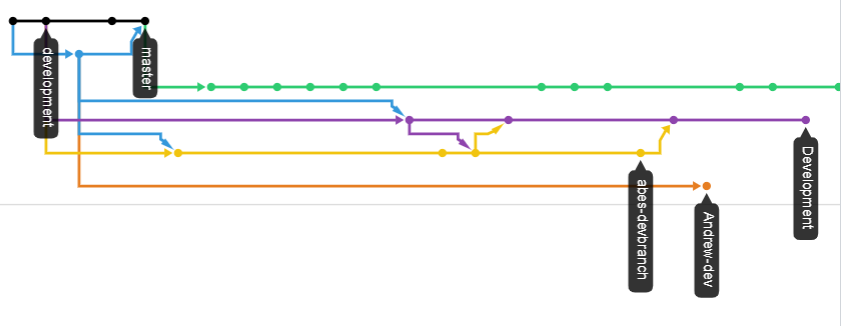

# Lab One

   This is Abe Huerta's lab one repository. It contains a single minimal webpage. It's purpose is to better understand how to use git commands and remote repositories.

### Collaborators:

   - Chris Fulton
   - Abe Huerta

### Things I've learned:

   Git and Github are amazing tools for keeping track of changes and working on projects in a team setting. The git commit history tools is great for seeing what changes have been made on the project as well as a great tool in case you need to revert back to an older version of the project. Github as well is a great tool to keep your project in the cloud and to allow open source capabilities. The varies branches allows for adding features with ease and making the development process easy without messing with the what the user sees. One of the ***biggest*** things I've learn is that before you push to a branch you need to pull from that branch and make sure your up to date with that branch before adding changes.

### list of most common git commands:

   - git add <filename>
   - git commit -m "some message"
   - git status
   - git checkout <branch>
   - git pull <branch>
   - git push

### example of what branching looks like:

